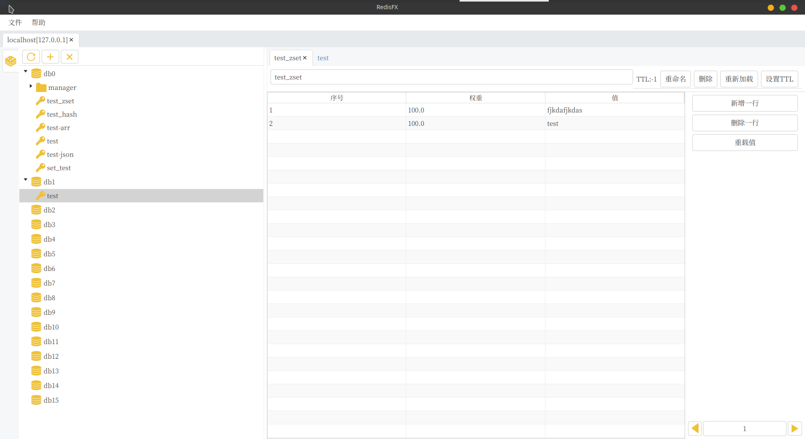

# 构建项目

构建RedisFX,请先执行以下命令:

    gradlew build

然后执行以下命令启动程序:

    gradlew run

**注意** : RedisFx 要求 **Java 15** 或者更高版本.

# 打包可执行程序

### 准备工作

下载Openjdk15或更高版本:

```
https://github.com/openjdk/jdk/releases
```

下载 javafx(linux/mac/window) 15 jmods:

```
https://gluonhq.com/products/javafx/
```

**注意:** 推荐国内用户到 https://www.injdk.cn/ 下载上述文件,下载比较快

将上述下载文件安装/解压然后设置环境变量:

linux/mac

```
export JAVA_HOME=#{YOU_JDK_INSTALL_PATH}
export JAVAFX_HOME=#{YOU_JAVAFX_JMODS_INSTALL PATH}
```

window:

```
set JAVA_HOME=#{YOU_JDK_INSTALL_PATH}
set JAVAFX_HOME=#{YOU_JAVAFX_JMODS_INSTALL PATH}
```

### 制作程序程序运行时

执行jdk自带jlink命令:

```
#{JAVA_HOME}/bin/jlink --module-path #{JAVAFX_HOME} --add-modules javafx.base,javafx.fxml,javafx.graphics,javafx.controls,java.sql,java.management,java.naming --output #{YOUR_OUTPUT_PATH}
```

**注意:** 如果上述步骤使用的是终端设置临时变量,所有操作需要在同一个终端程序中执行

### 运行程序

```
#{YOUR_OUTPUT_PATH}/bin/java -jar redisfx.jar
```

# 程序快照



