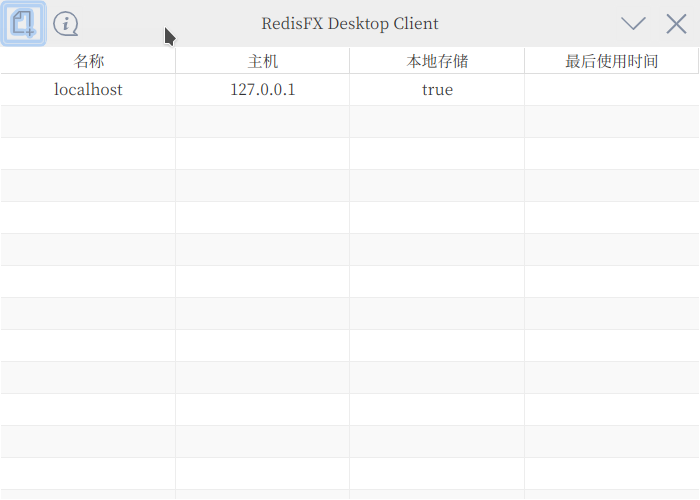
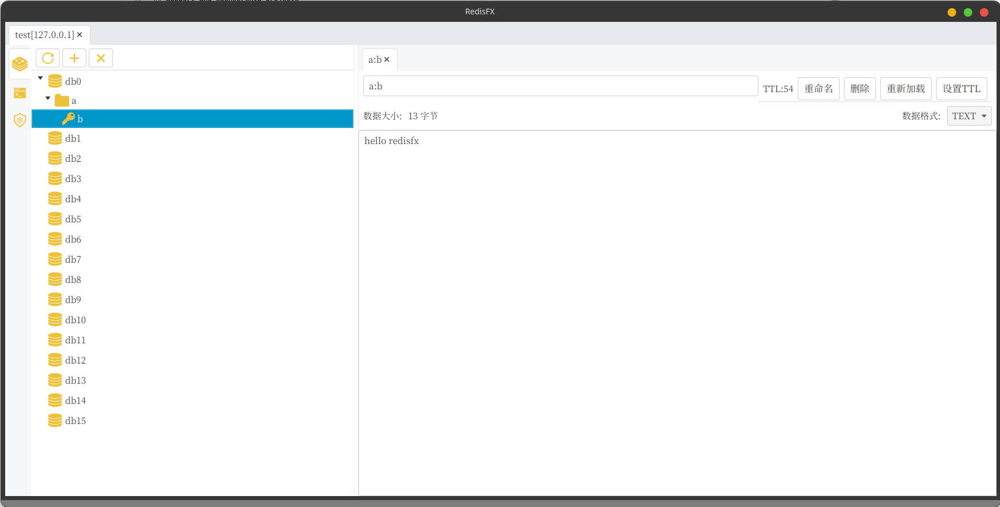
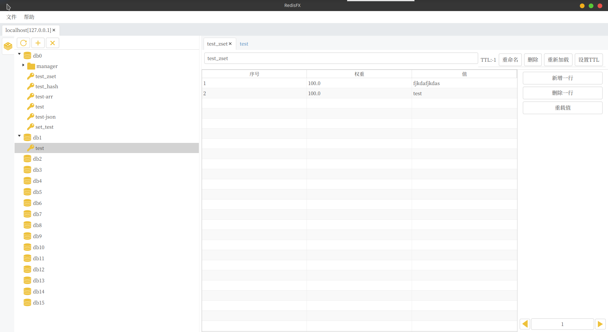

# Build

To build RedisFx, execute the following command:

    gradlew build

To run the main demo, execute the following command:

    gradlew run

**NOTE** : RedisFx requires **Java 15** and above.

# Package Executable File

### Preparation

Download openjdk15 and later:

```
https://github.com/openjdk/jdk/releases
```

Download javafx(linux/mac/window) 15 jmods:

```
https://gluonhq.com/products/javafx/
```

**Note:** china user recommend to https://www.injdk.cn/ download relation file

Add system environment variable:

linux/mac

```
export JAVA_HOME=#{YOU_JDK_INSTALL_PATH}
export JAVAFX_HOME=#{YOU_JAVAFX_JMODS_INSTALL PATH}
```

window:

```
set JAVA_HOME=#{YOU_JDK_INSTALL_PATH}
set JAVAFX_HOME=#{YOU_JAVAFX_JMODS_INSTALL PATH}
```

### Make program runtime

Execute jdk jlink command:

```
#{JAVA_HOME}/bin/jlink --module-path #{JAVAFX_HOME} --add-modules javafx.base,javafx.fxml,javafx.graphics,javafx.controls,java.sql,java.management,java.naming --output #{YOUR_OUTPUT_PATH}
```

**Note:** The above packing command should be executed in the same terminal/cmd program

### Run the program

```
#{YOUR_OUTPUT_PATH}/bin/java -jar redisfx.jar
```

# Snapshots




